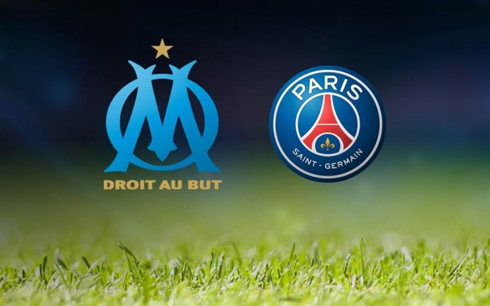

# OM x PSG T-Shirt Recognition

## Overview

This project intends to build three different approaches for object recognition. The objects to be recognized are football jerseys (t-shirts) of the two most popular French teams, the Olympique de Marseille and the Paris Saint-Germain.

The approaches that will be considered in this project are: Viola Jones algorithm and CNN (Convolutional Neural Network), SSD (Single Short Object Detection) and YOLO (You Only Look Once). Each of them can be found in the follows folders.

- [OM x PSG T-Shirt Recognition with Viola-Jones algorithm and CNN.](https://github.com/IgorMeloS/OMxPSG-T-Shirt-Recognition/tree/main/OMxPSG_T-Shirt_Recognition_with_ViolaJones_and_CNN.)
- OM x PSG T-Shirt Recognition with SSD (to be built).
- OM x PSG T-Shirt Recognition with YOLO (to be built).

A more detailed explanation about each method can be found inside each of above folders.

## Motivation

Football (soccer) the most popular sport around the world, capable to induce several sentiments as happiness or angry. Everyone, once time in your life have watched a football match. Some people might have a favorite team or not, but the fact is, we play football on the five continents, and your world cup is a big party of the sport. This sport played by 22 soccer players inside four lines, became a worldwide passion. On the other hand, we cannot to forget, the modern football is also a market environment with financial transactions and strategies. For many reasons, football is always a present subject in our life, we found it by the TV, radio, internet, friends, neighbors, and others sources. Soccer is everywhere.

The rivalry is another interesting feature of the soccer. In the football world, we can see many rivalries developed during your long history. A derby, for example, is a match between two clubs knew by your rivalry. For many football lovers, the derby is the most important match in the season, because there are others things beyond the sport, the pride of the club and fans. Around the world we can to found rivalries between countries as Brazil x Argentine. Between football clubs from different cities as Barcelona x Real Madrid, clubs from the same city as Manchester United x Manchester City. But also, the rivalries are present for the college, neighborhoods, and friends teams.

In France, it couldn’t be different, the rivalry is present in the hexagon. The well-known “Le classique” has place every year, figured by the two most popular French teams, the Olympique de Marseille (OM) and the Paris Saint-Germain (PSG). The Olympique de Marseille is the most popular team in France, in your list of titles contains a Champions League, the most important competition for the football clubs. In your long existence, the club of the south spread across France due to your glorious history, the gold star above your logo has an important weight for the club. Despite your popularity, OM nowadays does not have a competitive team, but your supporters is the power of the club.

The PSG, on the other hand, is the richest French team. The club wants to enter the hall of great teams of Europe. Always presenting good performances at international level, the PSG did never reach your main goal, become a European champion. Every year, the PSG is faced to the international failure (in the current season 20/21, it can to change). Regardless of your constant European failure, the club of the capital dominates the football at national level. The PSG became the second most popular French club, due to a considerable number of star players, a strong advertising campaign, and evidently, a good football.

Motivated by this French rivalry, OM x PSG, I want to bring it to the world of computer vision. The object recognition became...
