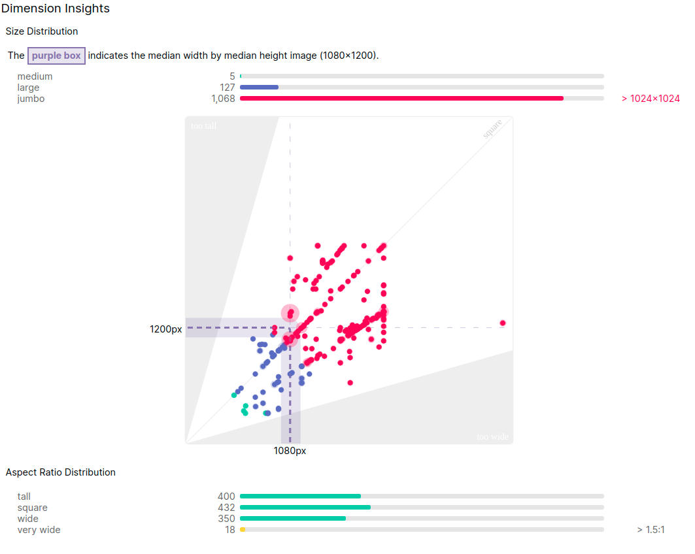

# OM x PSG T-Shirt Detection

## Overview

This project intends to build three different approaches to detect football (soccer) t-shirts of the two most popular French teams, the Olympique de Marseille and the Paris Saint-Germain.

**About the project**: The main objective of this project is to deploy a model to detect t-shirts from the both teams in real time. The idea behind this project started with my training on Computer Vision (CV). In the beginning of my Artificial Intelligence journey, I wanted deploy a model of Convolutional Neural Network (CNN) to predict images from the both French teams. But, in this moment, I didn't have enough knowledge about CV. I’ve postulated for a job, to work with CV and, I presented this idea as personal project. The experience was a little bite different I had imagined. When I was asked about image preprocessing, about labeling and especially if, my model was capable to detect object with video stream, I didn’t have the good answers.

After this experience, I decided to go into a deep formation on CV and fill the empty blanks. During this process, I've studied many aspects about image preprocessing, CNN architectures (for classification and detection tasks) and OpenCV skills. The results presented here is a part of my studies and a nice little reward.

As said before, this project contains three different approaches. The folders to each approach are organized as:

- [OM x PSG T-Shirt detection with composed model.](https://github.com/IgorMeloS/OMxPSG-T-Shirt-Detection/tree/main/OMxPSG_composed_model).
  - The first approach is composed by two step. The first step is the t-shirts detection using the Viola-Jones algorithm. Once we have the t-shirt detection, we extract the ROI (region of interest) and then, we classify the image. The classification model was trained with transfer learning on 1200 images, 600 for each team, using VGG16 and weights from ImageNet. The final result was HORRIBLE!
- [OM x PSG T-Shirt detection with SSD - editing]()
- [OM x PSG T-Shirt detection with YOLOv5.](https://github.com/IgorMeloS/OMxPSG-T-Shirt-Detection/tree/main/OMxPSG_YOLO)
  - Considering the YOLOv5 from the Ultralytics, we train the model on 640 images, 320 for each class, totaling 920 instances for the training. The final results give us a mAP_0.5 = 0.94 and mAP_0.5:0.95 = 0.64.

**A more detailed explanation about each method and the metrics results can be found inside each above folder.**

## Motivation

Football (soccer) the most popular sport around the world, capable to induce several sentiments as happiness or angry. Everyone, once time in your life have watched a football match. Some people might have a favorite team or not, but the fact is, we play football on the five continents, and your world cup is a big party of the sport. This sport played by 22 soccer players inside four lines, became a worldwide passion. On the other hand, we cannot to forget, the modern football is also a market environment with financial transactions and strategies. For many reasons, football is always a present subject in our life, we found it by the TV, radio, internet, friends, neighbors, and others sources. Soccer is everywhere.

The rivalry is another interesting feature of the soccer. In the football world, we can see many rivalries developed during your long history. A derby, for example, is a match between two clubs knew by your rivalry. For many football lovers, the derby is the most important match in the season, because there are others things beyond the sport, the pride of the club and fans. Around the world we can to found rivalries between countries as Brazil x Argentine. Between football clubs from different cities as Barcelona x Real Madrid, clubs from the same city as Manchester United x Manchester City. But also, the rivalries are present for the college, neighborhoods, and friends teams.

In France, it couldn’t be different, the rivalry is present in the hexagon. The well-known “Le classique” has place every year, figured by the two most popular French teams, the Olympique de Marseille (OM) and the Paris Saint-Germain (PSG). The Olympique de Marseille is the most popular team in France, in your list of titles contains a Champions League, the most important competition for the football clubs. In your long existence, the club of the south spread across France due to your glorious history, the gold star above your logo has an important weight for the club.

The PSG, on the other hand, is the richest French team. The club wants to enter the hall of great teams of Europe. Always presenting good performances at international level, the PSG did never reach your main goal, become a European champion. Every year, the PSG is faced to the international failure. Regardless of your constant European failure, the club of the capital dominates the football at national level. The PSG became the second most popular French club, due to a considerable number of star players, a strong advertising campaign, and evidently, a good football.

Motivated by this French rivalry, OM x PSG, I want to bring it into the world of computer vision and, be able to detect t-shirt of OM and PSG in real time.

## Dataset

The dataset for this project was obtained by web scraping, using the Selenium library. The code for the web scraping can be [found here](https://github.com/IgorMeloS/OMxPSG-T-Shirt-Detection/tree/main/web_scraping). The images come from the Facebook page of each team. After the scraping process, the total of photos of the Olympique de Marseille was 3159, for the Paris Saint-Germain was 4355.

Among the scraped photos, there’s a considerable amount of inappropriate for the project, a screening was performed, totaling 600 photos for each team.  These images was used to perform the classification model using transfer learning. For the object detect task, another screening was made, totaling 320 images for each team. We present an image of width and height distribution (over 1200 images).

As we can see, almost all images have a good resolution and, the majority of images have a square aspect ratio. It's important to know the size distribution of the images, it can aid us to take decision about image resize. This graphic come from the [Roboflow](https://roboflow.com/) website.

**Observation**

In this repository, we found the full dataset with 600 images for each team. The dataset containing 320 images of each class was not uploaded. If you want to train the object detection model, you must select the images on the full [dataset](https://github.com/IgorMeloS/OMxPSG-T-Shirt-Detection/tree/main/dataset).

### Annotations

Annotation is required for the object detection tasks. For this project, I’ve tried two annotations tools, [LabelImg](https://github.com/tzutalin/labelImg) (completely free) and [Roboflow](https://roboflow.com/). Why have I decided to use Roboflow? For one simple reason, experimentation. The website offers to us many tools as image labeling, image preprocessing (resize, rotation, crop etc.). What’s the problem to use Roboflow? There’s no problem, but the fact is, you share your dataset with the website. If you dont't want to share your data, you can use OpenCV to preprocess your images (and make statistics) and LabelImg for labeling (or other annotation tools of your preference).

## Frameworks, API and libraries

In this project the models was trained using TensorFlow (2.1) and PyTorch (1.9). The APIs were TensorFlow Object Detection (for the SSD model) and Yolov5 from Ultralytics. OpenCV was used to the image preprocessing, to train the Haar cascade (train and detect) and video stream. All models were run on the GPU, otherwise, the time of running increases considerably.

## Applications

Depending on your problem, object detection can be the first step of your task. For example, to count the number of vehicles on the road, we first need a model to detect cars and then, a model to track the detected objects and count them. I'm looking for a good video, with a static camera to develop some applications, as count the number of detection, measure speed and distance.I hope to submit it as soon as possible.
